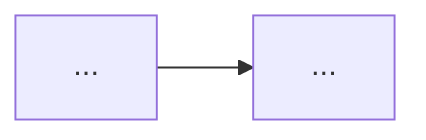

# 개념 글 쓰기

`categories: [개념]` 글을 만든다. 에러 해결 기록은 `/trouble` 을 쓴다.

## 순서

1. 먼저 물어본다. **내가 답하기 전에는 글을 쓰지 마.**
   - 오늘 배운 게 뭔지
   - 이게 없으면 뭐가 불편한지 (몰라도 됨, 같이 찾자)
   - 어디가 헷갈렸는지
   - 직접 쳐본 코드가 있는지
2. 답을 받으면 아래 템플릿으로 `_posts/` 에 글을 만든다.
   파일명과 Front Matter 는 `CLAUDE.md` 5절을 따른다.
3. 아래 점검을 하고, 최종본과 점검 결과를 함께 보여준다.
4. **내가 좋다고 하기 전에는 커밋하지 마.** 확인하면 커밋하고 push 한다.

## 템플릿

````markdown
---
layout: post
title: "[OO은 왜 필요한가 — 'OO 정리'보다 이 쪽이 좋다]"
date: YYYY-MM-DD HH:MM:SS +0900
categories: [개념]
tags: [태그1, 태그2, 태그3]
snippet: |
  핵심 코드 3~10줄
---

## 이게 없으면 뭐가 불편할까

개념이 해결해 주는 문제부터 쓴다. 정의는 아직 쓰지 않는다.

## 한 문장으로 말하면

전문 용어 없이 한 문장. 그 아래 정확한 정의를 덧붙인다.
비유 하나와 그 비유의 한계를 함께 적는다.

## 그림으로 보기

*(흐름이나 구조가 있을 때만. 없으면 이 섹션은 통째로 뺀다.)*



다이어그램 한 문장 설명.

## 직접 해보기

가장 단순한 예시 하나. 코드와 결과.

## 헷갈렸던 점

처음에 잘못 이해한 것, 비슷한 개념과의 차이(표 활용).

## 더 학습하면 좋은 개념

- **개념 이름** — 한 줄 설명과 왜 학습해야 하는지

## 참고 자료

- [공식 문서 제목](URL)
````

## 개념 글 점검

`CLAUDE.md` 공통 점검에 더해 아래를 확인한다.

- [ ] 없는 프로젝트 배경을 만들지 않았는가?
- [ ] 예시가 하나로 좁혀져 있는가? (옵션 나열이 아닌가)
- [ ] "헷갈렸던 점" 섹션이 있는가?
- [ ] 새 개념마다 비유가 있고, 비유의 한계도 적혀 있는가?
- [ ] "더 학습하면 좋은 개념"이 3~5개 있고 각각 왜 필요한지 적혀 있는가?
- [ ] 공식 문서 링크가 참고 자료에 있는가?
- [ ] 넣은 다이어그램이 문장보다 이해에 도움이 되는가? 노드 7개 이하이고 한 문장 설명이 붙어 있는가?
- [ ] 비교할 내용에 표를 썼는가?