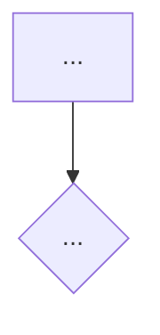

# 트러블슈팅 글 쓰기

`categories: [트러블슈팅]` 글을 만든다. 개념 정리는 `/note` 를 쓴다.

## 순서

1. 먼저 물어본다. **내가 답하기 전에는 글을 쓰지 마.**
   - 무엇을 하려던 중이었는지
   - 에러 메시지 원문 (있으면 그대로 붙여달라고 해)
   - 뭘 시도했고 왜 안 됐는지 — **실패한 것도 다 물어봐**
   - 어떻게 풀었는지
   - 왜 그랬던 건지 아는지
2. 답을 받으면 아래 템플릿으로 `_posts/` 에 글을 만든다.
   파일명과 Front Matter 는 `CLAUDE.md` 5절을 따른다.
3. 아래 점검을 하고, 최종본과 점검 결과를 함께 보여준다.
4. **내가 좋다고 하기 전에는 커밋하지 마.** 확인하면 커밋하고 push 한다.

## 원인을 모르는 경우

고쳤는데 왜 됐는지 모를 때가 있다. 그럴 때 그럴듯한 이유를 지어내지 마.
Result 에 "아직 모르는 것" 으로 솔직하게 적는다. 나중에 알게 되면 그때 채운다.

## 템플릿

````markdown
---
layout: post
title: "[OO 문제를 OO로 해결하기]"
date: YYYY-MM-DD HH:MM:SS +0900
categories: [트러블슈팅]
tags: [태그1, 태그2, 태그3]
snippet: |
  에러 메시지 또는 해결 코드
---

## 무엇을 하려던 중이었나 (Situation)

## 어떤 문제가 났나 (Task)

```
에러 메시지 원문
```

## 해결 과정 (Action)

### 처음 시도한 방법

무엇을 했고 왜 안 됐는지.

### 원인을 찾은 과정

*(찾아가는 단계가 여러 갈래였다면 다이어그램으로. 단순했다면 글로.)*



### 최종 해결

코드와, 왜 이게 되는지.

## 결과 (Result)

무엇이 해결됐고 무엇을 배웠는지.
원인을 모른다면 "아직 모르는 것" 으로 적는다.

## 더 학습하면 좋은 개념

- **개념 이름** — 한 줄 설명과 왜 학습해야 하는지

## 참고 자료

- [공식 문서 제목](URL)
````

## 트러블슈팅 글 점검

`CLAUDE.md` 공통 점검에 더해 아래를 확인한다.

- [ ] Action 이 글의 60% 이상인가?
- [ ] 실패한 시도가 남아 있는가?
- [ ] 에러 메시지 원문이 있는가?
- [ ] 없는 수치를 만들지 않았는가? (정량 지표는 있을 때만)
- [ ] 원인을 모르는 부분을 아는 척하지 않았는가?
- [ ] "더 학습하면 좋은 개념"이 3~5개 있고 각각 왜 필요한지 적혀 있는가?
- [ ] 공식 문서 링크가 참고 자료에 있는가?