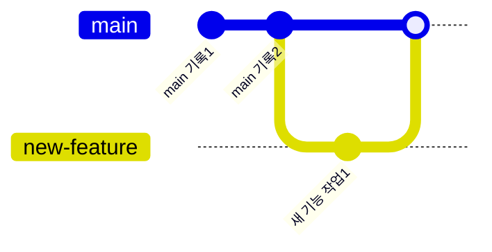
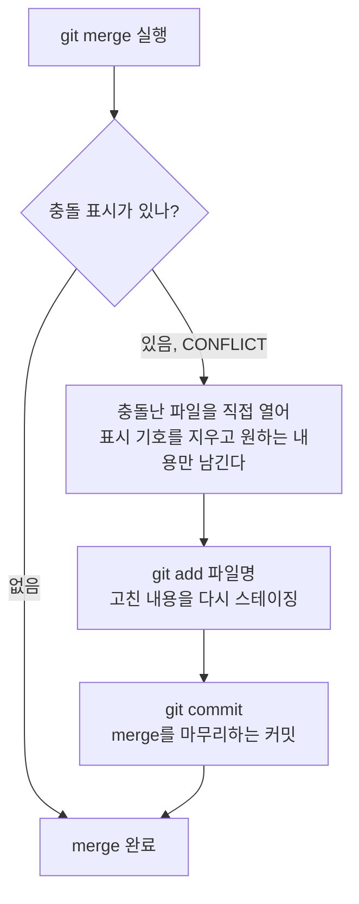

지난번에 브랜치를 만들고 merge로 합치는 것까지 배웠다.
그런데 두 브랜치에서 **같은 부분을 서로 다르게 고쳤다면** 어떻게 될까?
이번 글에서는 그 상황, 즉 **충돌(conflict)**이 생겼을 때 어떻게 해결하는지 정리해본다.

## 먼저, 충돌이 없는 merge 복습

브랜치는 원래 줄기에서 갈라져 나온 또 다른 줄기이고,
merge는 그 갈라진 줄기를 다시 하나로 합치는 것이었다.



서로 **다른 파일**을 고쳤거나, 같은 파일이라도 **다른 줄**을 고쳤다면
Git이 알아서 두 내용을 합쳐준다. 문제는 **같은 파일의 같은 줄**을 양쪽에서 다르게 고쳤을 때다.

| 명령어 | 언제 쓰나 |
|---|---|
| `git branch [이름]` | 새로운 갈래(브랜치)를 만들고 싶을 때 |
| `git checkout [이름]` | 만들어둔 브랜치로 옮겨가고 싶을 때 |
| `git merge [브랜치이름]` | 다른 브랜치에서 작업한 내용을 지금 브랜치로 합치고 싶을 때 |

## 충돌은 왜 생길까

예를 들어 `main` 브랜치와 `new-feature` 브랜치에서 똑같이 `README.md`의 1번째 줄을 서로 다르게 고쳤다고 해보자.

```mermaid
flowchart TD
    A[main: README.md 1번째 줄\n"안녕하세요"] --> M{merge 시도}
    B[new-feature: README.md 1번째 줄\n"반갑습니다"] --> M
    M -->|같은 줄, 다른 내용| C[Git이 판단 못함\nCONFLICT 발생]
```

이럴 때 Git은 "둘 중 어느 걸 남길지 내가 정할 수 없으니, 사람이 직접 골라달라"고 멈춰선다.
이게 바로 **conflict(충돌)**다.

## 충돌이 나면 화면에 보이는 것

merge를 실행했을 때 충돌이 나면, 파일 안에 이런 표시가 생긴다.

```
<<<<<<< HEAD
안녕하세요
=======
반갑습니다
>>>>>>> new-feature
```

- `<<<<<<< HEAD` ~ `=======` 사이: 지금 내가 있는 브랜치(main)의 내용
- `=======` ~ `>>>>>>> new-feature` 사이: 합치려고 했던 브랜치(new-feature)의 내용

## 충돌 해결하는 순서



| 단계 | 명령어 / 작업 | 하는 일 |
|---|---|---|
| 1 | `git merge [브랜치이름]` | 두 브랜치를 합쳐본다 |
| 2 | (직접 파일 수정) | `<<<<<<<`, `=======`, `>>>>>>>` 표시를 지우고 원하는 내용만 남긴다 |
| 3 | `git add [파일명]` | 충돌을 해결한 파일을 다시 스테이징한다 |
| 4 | `git commit` | merge를 마무리하는 커밋을 남긴다 |

핵심은, **충돌 표시 기호(`<<<<<<<`, `=======`, `>>>>>>>`)는 Git이 남긴 안내선일 뿐,
반드시 사람이 직접 지우고 최종 내용을 결정해야 한다**는 점이다.

## 오늘 정리

- merge는 두 브랜치를 합치는 것이고, 같은 부분을 다르게 고쳤을 때만 conflict가 난다.
- conflict가 나면 Git이 파일 안에 두 내용을 함께 보여준다.
- 표시 기호를 지우고 원하는 내용을 남긴 뒤, `git add` → `git commit`으로 마무리하면 된다.

다음에는 되돌리기(`git reset`, `git revert`)를 조금 더 깊게 다뤄보고 싶다.
