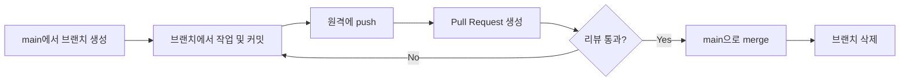
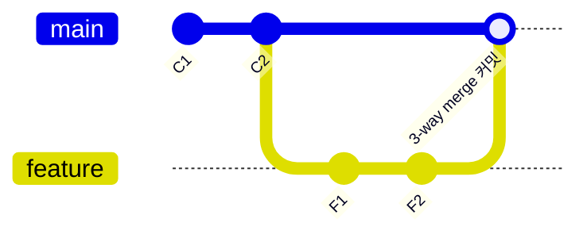

## 들어가며 (Situation)

브랜치를 만들어서 작업하는 것까지는 익숙해졌지만,
막상 `git merge`를 실행할 때마다 "지금 fast-forward인지, 3-way merge인지,
아니면 squash를 써야 하는지"가 헷갈렸다.
merge 명령어 하나에도 여러 방식이 섞여 있다는 걸 알고, 개념부터 정리해보기로 했다.

## 문제 상황 (Task)

정리가 필요했던 부분은 크게 두 가지였다.

- **브랜치 생성부터 merge까지의 기본 흐름**을 순서대로 설명할 수 있는가
- **merge 방식(fast-forward / 3-way merge / squash merge)**의 차이와,
  각각을 언제 쓰는 게 맞는지

rebase는 이번 글에서는 다루지 않고, merge 계열 방식만 범위로 좁혔다.

## 해결 과정 (Action)

### 1) 브랜치 생성 → 작업 → merge, 기본 흐름



```bash
# 1. main 기준으로 새 브랜치 생성 및 전환
git switch -c feature/login

# 2. 작업 후 커밋
git add .
git commit -m "로그인 기능 추가"

# 3. 원격 저장소에 push
git push origin feature/login

# 4. (GitHub에서 Pull Request 생성 및 리뷰)

# 5. main으로 전환 후 merge (로컬에서 직접 할 경우)
git switch main
git merge feature/login
```

### 2) merge 방식 비교

같은 `git merge` 명령이라도, `main`과 브랜치의 상태에 따라
실제로 일어나는 일이 다르다.

| 방식 | 발생 조건 | 커밋 히스토리 | 비고 |
|---|---|---|---|
| **Fast-forward merge** | merge 대상 브랜치가 갈라진 뒤로 `main`에 새 커밋이 없을 때 | 새 merge 커밋 없이 브랜치 커밋이 `main`에 그대로 이어붙음 | `git merge --no-ff`로 강제로 merge 커밋을 남길 수 있음 |
| **3-way merge** | 갈라진 이후 `main`에도 새 커밋이 쌓였을 때 | 두 브랜치의 마지막 커밋과 공통 조상을 비교해 **merge 커밋**을 새로 만듦 | 충돌이 발생할 수 있는 지점 |
| **Squash merge** | 브랜치의 여러 커밋을 하나로 합쳐서 `main`에 반영하고 싶을 때 | 브랜치의 커밋 여러 개가 **커밋 하나**로 합쳐져 `main`에 추가됨 | 브랜치 자체의 히스토리는 사라짐 (PR에는 남아있음) |



Fast-forward는 `main`이 그동안 가만히 있었을 때만 가능하다.
즉 "브랜치가 갈라진 시점 이후로 `main`에 아무 변화가 없어야" 포인터만 이동시키는
fast-forward가 일어나고, 그렇지 않으면 Git은 자동으로 3-way merge(merge 커밋 생성)를 수행한다.

Squash merge는 방식이라기보다 **선택**에 가깝다.
GitHub PR 화면에서 "Squash and merge" 버튼을 누르면,
브랜치의 커밋이 몇 개든 상관없이 `main`에는 커밋 하나만 추가된다.
기능 단위로 히스토리를 깔끔하게 남기고 싶을 때 유용하지만,
브랜치 안에서의 세부 작업 이력(시행착오 커밋들)은 `main` 히스토리에서는 보이지 않게 된다.

### 3) 언제 어떤 방식을 쓸까

| 상황 | 추천 방식 |
|---|---|
| 개인 프로젝트, 브랜치 수명이 짧고 커밋이 적음 | Fast-forward (기본 `git merge`) |
| 팀 프로젝트, 여러 명이 동시에 `main`을 변경 | 3-way merge (merge 커밋으로 "언제 합쳐졌는지" 기록 남김) |
| PR 하나에 시행착오 커밋이 많이 쌓임 | Squash merge |

## 결과 (Result)

merge 방식이 하나가 아니라 **`main`과 브랜치 상태에 따라 자동으로 결정되거나(fast-forward/3-way),
직접 선택하는 것(squash)**이라는 걸 구분하게 됐다.
이전에는 merge 후 히스토리에 merge 커밋이 생기는 이유를 몰랐는데,
이제는 "`main`에 새 커밋이 있었기 때문에 3-way merge가 일어난 것"이라고 설명할 수 있다.

정량적인 지표는 없지만, 앞으로는 merge 전에
`git log --oneline --graph main feature/브랜치명`으로
갈라진 지점을 먼저 확인하는 습관을 들이기로 했다.

## 더 학습하면 좋은 개념

- **Rebase vs Merge** — merge 대신 히스토리를 한 줄로 펴는 rebase를 알면,
  왜 어떤 팀은 merge 커밋을 아예 만들지 않으려 하는지 이해할 수 있다.
- **Merge Conflict 해결 과정** — 3-way merge에서 충돌이 발생했을 때 실제로 어떻게
  해결하는지는 별도로 정리한 [브랜치 merge 충돌 해결하기]({{ site.baseurl }}/2026/08/31/branch-merge-conflict-solve.html) 글 참고.
- **Merge 전략(Git-flow, GitHub-flow 등)** — 언제 브랜치를 만들고 언제 합칠지에 대한
  팀 규칙은 [브랜치 전략 비교]({{ site.baseurl }}/2026/08/31/git-branch-strategy-comparison.html) 글에서 다뤘다.
- **Protected Branch / Branch Ruleset** — `main`에 직접 push를 막고 PR을 통해서만
  merge하도록 강제하는 GitHub 설정. 실무에서 3-way merge를 강제하는 방법이기도 하다.
- **Fast-forward only 정책 (`--ff-only`)** — merge 커밋 자체를 아예 만들지 않도록
  강제하는 옵션으로, 언제 이런 정책이 유효한지 알아두면 좋다.

## 참고 자료

- [Git 공식 문서 - git-merge](https://git-scm.com/docs/git-merge)
- [Git 공식 Book - Basic Branching and Merging](https://git-scm.com/book/en/v2/Git-Branching-Basic-Branching-and-Merging)
- [GitHub 공식 문서 - About pull request merges](https://docs.github.com/en/pull-requests/collaborating-with-pull-requests/incorporating-changes-from-a-pull-request/about-pull-request-merges)
