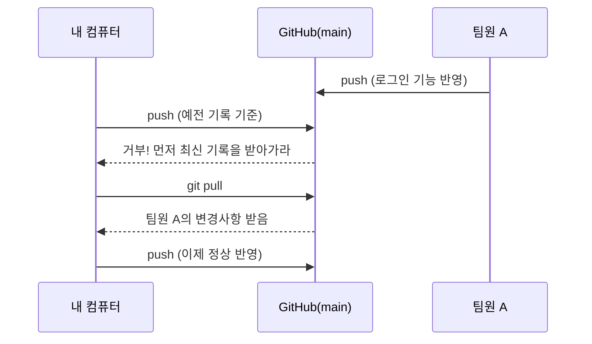
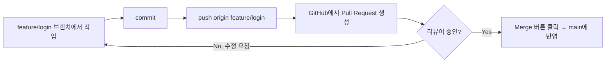

> 아래 예시는 실제 프로젝트가 아니라, 개념을 설명하기 위해 임의로 만든 **예시 상황**입니다.

## 들어가며 (Situation)

혼자 블로그 저장소에 `git add` → `git commit` → `git push`만 반복하다가,
"팀원이 생기면 이 순서만으로는 부족하다"는 걸 알게 됐다.
예를 들어 두 명이 같은 저장소에서 각자 다른 기능을 작업한다고 가정해보자.

- 나는 `main` 브랜치에서 바로 작업하고 있었다.
- 팀원 A는 `feature/login` 브랜치에서 로그인 기능을 작업 중이다.

이 상황에서 "언제 pull을 받아야 하는지", "PR은 커밋·push와 뭐가 다른지"가 헷갈렸다.

## 문제 상황 (Task)

정리하고 싶었던 질문은 세 가지였다.

1. `commit`과 `push`는 왜 단계가 나뉘어 있는가?
2. `pull`을 안 하고 `push`하면 무슨 일이 생기는가?
3. GitHub에만 있는 `Pull Request(PR)`는 git 명령어(`commit`, `push`, `pull`)와 어떻게 다른가?

## 해결 과정 (Action)

### 1. commit과 push는 별개의 단계다

`commit`은 **내 컴퓨터 안(Local Repository)에만** 기록을 남기는 것이고,
`push`는 그 기록을 **GitHub(Remote Repository)로 올리는 것**이다.

```bash
# 예시 코드
git add index.md
git commit -m "소개 문단 수정"   # 아직 내 컴퓨터에만 있는 기록
git push origin main             # 이제서야 GitHub에 반영됨
```

| 단계 | 어디에 기록이 남나 | 되돌리기 난이도 |
|---|---|---|
| `commit` | 내 컴퓨터(Local) | 쉬움 (`git reset` 등으로 로컬에서만 조정 가능) |
| `push` | GitHub(Remote) | 어려움 (남들이 이미 받아갔을 수 있음) |

즉 `commit`을 여러 번 하다가 마지막에 한 번만 `push`해도 되고,
아직 완성되지 않은 기록은 `push`하지 않고 로컬에만 둘 수도 있다.

### 2. pull 없이 push하면 충돌이 난다

팀원 A가 먼저 `feature/login`을 `main`에 merge하고 GitHub에 반영했는데,
나는 그 사실을 모른 채 예전 `main` 상태에서 계속 작업하다 push하면 거부당한다.



```bash
# 예시 코드
git pull origin main   # 거부당했을 때, 최신 기록부터 받아온다
# 충돌(conflict)이 있으면 해결 후 다시 commit
git push origin main
```

**핵심**: `push` 전에 `pull`을 먼저 하는 습관을 들이면, 뒤늦게 최신 기록과 부딪히는 상황을 줄일 수 있다.

### 3. PR은 "합쳐도 되는지 검토받는 단계"다

여기서 헷갈렸던 부분이 풀렸다. `commit`·`push`·`pull`은 **git 명령어**이고,
`Pull Request`는 **GitHub이라는 서비스가 제공하는 기능**이다.
즉 git 자체에는 PR이라는 개념이 없다.

| 항목 | commit / push / pull | Pull Request(PR) |
|---|---|---|
| 어디서 실행하나 | 터미널 (git 명령어) | GitHub 웹 화면 |
| 하는 일 | 기록을 남기고, 올리고, 받아온다 | "이 브랜치를 main에 합쳐도 될지" 리뷰 요청 |
| merge 시점 | 직접 `git merge`로 즉시 합쳐짐 | 리뷰·승인 후에 합쳐짐(버튼 클릭) |



예시로, 팀원 A는 아래 순서로 작업했다고 가정할 수 있다.

```bash
# 예시 코드
git checkout -b feature/login
# ... 코드 작성 ...
git add .
git commit -m "로그인 기능 추가"
git push origin feature/login
```

그 다음 GitHub 화면에서 `feature/login` → `main`으로 **Pull Request**를 만들고,
리뷰어가 코드를 확인한 뒤 승인하면 그제서야 `main`에 merge된다.
즉 PR은 "push까지 끝난 브랜치를 main에 바로 합치지 말고, 한 번 더 검토받자"는 절차다.

## 결과 (Result)

| 이전 이해 | 지금 이해 |
|---|---|
| commit = push = 같은 것처럼 사용 | commit(로컬 기록)과 push(원격 반영)는 분리된 단계 |
| pull은 "필요할 때만" 하는 것 | push 전에 pull부터 하는 게 기본 습관 |
| PR도 그냥 git 명령어인 줄 알았음 | PR은 GitHub의 리뷰·merge 절차이고, git 명령어에는 없는 개념 |

가장 크게 바뀐 습관은, 이제 `push` 하기 전에 반사적으로 `git pull`을 먼저 해보게 된 것이다.

## 더 학습하면 좋은 개념

- **git rebase** — merge 말고 커밋 기록을 한 줄로 이어붙이는 방법. PR 전에 커밋을 정리할 때 자주 쓰인다.
- **Merge conflict 해결** — pull이나 merge 중 같은 줄을 서로 고쳤을 때 나는 충돌을 직접 손으로 고치는 법.
- **Fork & Pull Request** — 내 저장소가 아닌 남의 오픈소스 저장소에 기여할 때는 clone이 아니라 fork를 먼저 한다.
- **Code Review 관례** — PR에 리뷰어를 지정하고, 코멘트를 주고받는 팀 협업 문화.
- **CI(Continuous Integration)** — PR을 올리면 자동으로 테스트가 돌아가게 만드는 구조. PR 승인 조건에 자주 포함된다.

## 참고 자료

- [Git 공식 문서 - git-push](https://git-scm.com/docs/git-push)
- [Git 공식 문서 - git-pull](https://git-scm.com/docs/git-pull)
- [GitHub Docs - About pull requests](https://docs.github.com/en/pull-requests/collaborating-with-pull-requests/proposing-changes-to-your-work-with-pull-requests/about-pull-requests)
