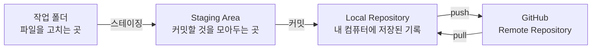
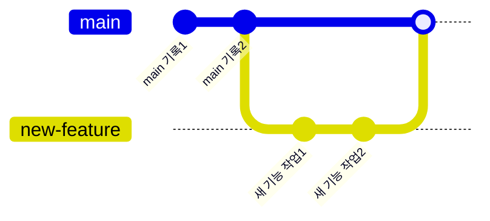
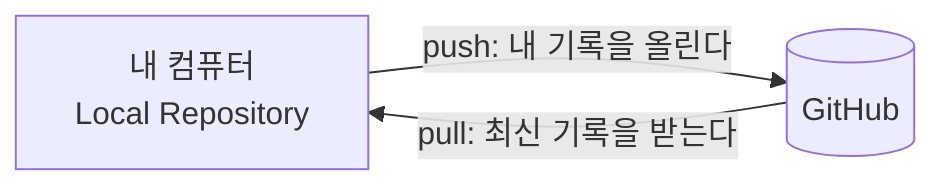
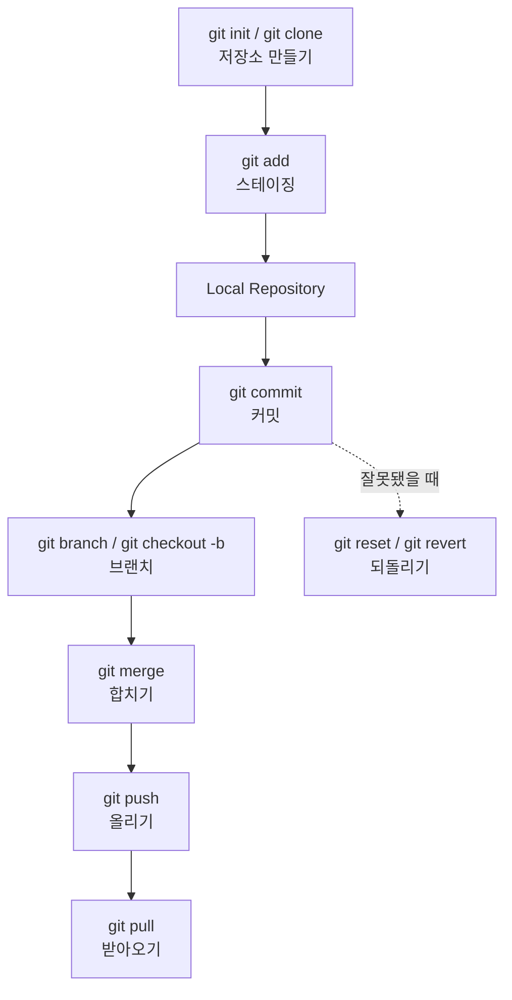

이번 주에는 나만의 폴더를 **버전 관리가 되는 저장소**로 만들고,
바꾼 내용을 기록하고, GitHub에 올리고 받아오는 법까지 배웠다.
배운 순서대로 하나씩 정리해본다.

## 전체 그림부터 보기

Git은 파일이 이동하는 "공간"이 여러 개 있다고 생각하면 이해가 쉽다.

이 그림 하나만 기억해도 오늘 배운 명령어가 어디서 쓰이는지 헷갈리지 않는다.

## 1. 저장소 만들기

저장소(Repository)는 "이 폴더의 변경 기록을 관리하겠다"고 Git에게 알려주는 것이다.
새로 시작할 때와, 이미 있는 저장소를 가져올 때 쓰는 명령이 다르다.

| 명령어 | 언제 쓰나 |
|---|---|
| `git init` | 지금 폴더를 새로운 저장소로 처음 만들고 싶을 때 |
| `git clone [주소]` | GitHub에 이미 있는 저장소를 내 컴퓨터로 통째로 가져오고 싶을 때 |

## 2. 스테이징

파일을 고쳤다고 바로 기록(커밋)되는 것은 아니다.
그중에서 **이번 기록에 담을 것만 골라두는 단계**가 스테이징이다.

| 명령어 | 언제 쓰나 |
|---|---|
| `git add [파일명]` | 고친 파일 중 이번 커밋에 포함시킬 것을 고르고 싶을 때 |
| `git add .` | 고친 파일을 전부 한 번에 담고 싶을 때 |

## 3. Local Repository

Local Repository는 **내 컴퓨터 안에만 있는 저장 기록 창고**다.
아직 GitHub에 올리기 전이라도, 커밋을 하면 이 창고 안에 기록이 남는다.

- 인터넷이 연결되어 있지 않아도 커밋하고 기록을 남길 수 있다.
- push를 하기 전까지는 이 기록이 나만 볼 수 있는 상태다.

## 4. 커밋

스테이징에 담아둔 것을 **한 덩어리의 기록**으로 남기는 것이 커밋이다.

| 명령어 | 언제 쓰나 |
|---|---|
| `git commit -m "메시지"` | 스테이징에 담은 내용을 하나의 기록으로 남기고 싶을 때 |

메시지를 남기는 이유는, 나중에 기록을 봤을 때 "이때 무엇을 왜 바꿨는지" 알아보기 위해서다.

## 5. 브랜치

브랜치는 **원래 기록 줄기에서 갈라져 나온 또 다른 줄기**다.
새로운 기능을 시도해보고 싶을 때, 원래 기록을 건드리지 않고 따로 작업할 수 있다.

| 명령어 | 언제 쓰나 |
|---|---|
| `git branch [이름]` | 새로운 갈래(브랜치)를 만들고 싶을 때 |
| `git checkout [이름]` | 만들어둔 브랜치로 옮겨가고 싶을 때 |
| `git checkout -b [이름]` | 브랜치를 만들면서 바로 그 브랜치로 옮겨가고 싶을 때 |

## 6. push

push는 **내 Local Repository의 기록을 GitHub로 올리는 것**이다.

| 명령어 | 언제 쓰나 |
|---|---|
| `git push` | 내 컴퓨터에만 있던 커밋 기록을 GitHub에도 반영하고 싶을 때 |

## 7. pull

pull은 push의 반대다. **GitHub에 있는 기록을 내 컴퓨터로 받아오는 것**이다.

| 명령어 | 언제 쓰나 |
|---|---|
| `git pull` | 다른 곳(다른 컴퓨터, 팀원)이 GitHub에 올린 최신 기록을 내 컴퓨터로 가져오고 싶을 때 |

## 8. merge

merge는 **갈라졌던 브랜치를 다시 하나로 합치는 것**이다.
5번에서 만든 브랜치에서 작업을 끝냈다면, 원래 브랜치로 돌아와 merge로 합친다.

| 명령어 | 언제 쓰나 |
|---|---|
| `git merge [브랜치이름]` | 다른 브랜치에서 작업한 내용을 지금 브랜치로 합치고 싶을 때 |

## 9. 되돌리기

기록을 잘못 남겼거나, 고친 내용을 없던 일로 하고 싶을 때 되돌리기를 쓴다.

| 명령어 | 언제 쓰나 |
|---|---|
| `git reset [커밋]` | 잘못 남긴 커밋을 이전 상태로 되돌리고 싶을 때 |
| `git revert [커밋]` | 이전 커밋은 그대로 두고, 그 내용을 취소하는 새 커밋을 남기고 싶을 때 |

두 명령의 차이는, `reset`은 기록 자체를 지우고 되돌아가는 것이고
`revert`는 기록은 남긴 채로 "취소했다"는 기록을 새로 추가하는 것이다.

## 이번 주 정리

전체 흐름은 결국 **"고치기 → 고른다 → 기록한다 → 나눠서 작업한다 → 합친다 → 올리고 받는다"**로 이어진다.
막히면 이 순서를 다시 떠올려보면 될 것 같다.
