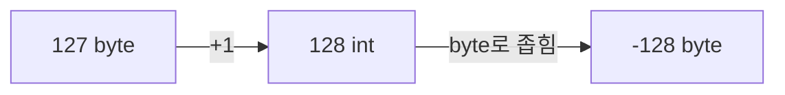

byte 변수에 127을 넣고 1을 더했더니 128이 아니라 -128이 나왔다.

## 이게 없으면 뭐가 불편할까

127 더하기 1은 128이어야 한다. 그런데 실제로 코드를 돌려보면 -128이 나온다. 이 현상을 모르면 계산이 잘못됐다고 생각해서 엉뚱한 곳에서 원인을 찾거나, 자료형이 표현할 수 있는 범위를 신경 쓰지 않고 아무 값이나 넣게 된다.

## 한 문장으로 말하면

오버플로우(overflow)는 자료형이 표현할 수 있는 값의 범위를 넘으면, 다음 값이 아니라 반대편 끝 값으로 돌아가는 현상이다. 반대로 최솟값 아래로 내려가는 경우는 언더플로우(underflow)라고 한다.

비유: 자동차 트립미터가 999.9km를 넘으면 0000.0으로 돌아가는 것과 비슷하다. 다만 이 비유에는 한계가 있다. 트립미터는 최댓값을 넘으면 0으로 돌아가지만, byte는 최댓값(127)을 넘으면 0이 아니라 최솟값(-128)으로 돌아간다. 그 이유는 byte가 값을 저장하는 방식 때문이다.

## 그림으로 보기



`bnum++`은 계산 자체는 int 크기로 하고, 그 결과를 다시 byte 크기로 좁혀서 저장한다. 이 좁히는 과정에서 128이 -128로 바뀐다.

## 직접 해보기

```java
byte bnum = 127;
bnum++;
System.out.println(bnum);
```

실행하면 128이 아니라 -128이 출력된다.

## 헷갈렸던 점

왜 하필 -128이 나오는지가 헷갈렸다. 두 가지를 알아야 이해가 됐다.

**1. byte는 8비트, 부호 있는 2의 보수 표현을 쓴다.**

공식 문서에서는 byte 자료형을 8비트 크기의, 부호 있는 2의 보수 방식 정수라고 설명한다. 최솟값은 -128, 최댓값은 127이다.

8비트로는 256가지 값만 표현할 수 있다. byte는 이 중 절반을 양수(0~127)로, 나머지 절반을 음수(-128~-1)로 나눠 쓴다. 맨 앞자리 비트(부호 비트)가 0이면 양수, 1이면 음수로 읽는 방식이다.

여기서 왜 최댓값(127)과 최솟값(-128)의 절댓값이 다른지도 이 나누기로 설명된다. 양수 쪽 128개는 0부터 시작해서 0, 1, 2, ..., 127까지다. 0이 이 128개 안에 끼어 있는 만큼, 음수 쪽 128개는 -1부터 -128까지 내려가야 개수가 맞는다. 그래서 양수는 127까지만 가고, 음수는 그보다 하나 더 먼 -128까지 간다.

| 단계 | 값(10진수) | 8비트 이진수 |
|------|------------|--------------|
| bnum (원래 값) | 127 | 0111 1111 |
| bnum + 1 (int로 계산됨) | 128 | 1000 0000 |
| bnum++ 후 byte에 저장된 값 | -128 | 1000 0000 |

128을 8비트로 나타내면 `1000 0000`이다. 이 비트 패턴은 부호 없는 정수로 보면 128이지만, byte는 부호 있는 자료형이라 맨 앞자리 1을 부호 비트로 읽는다. 그래서 같은 비트 패턴이 -128로 해석된다.

**2. `++`는 계산을 int로 한 뒤, 그 결과를 byte로 좁혀서(narrowing) 다시 저장한다.**

자바 언어 명세(JLS)에 따르면, `+=` 같은 복합 대입 연산자 `E1 op= E2`는 `E1 = (T) ((E1) op (E2))`와 같은 것으로 정의된다. 여기서 `T`는 `E1`의 자료형이다. 즉 연산 결과를 원래 변수의 자료형으로 자동으로 좁혀서(형변환해서) 다시 대입한다는 뜻이다.

`++`도 같은 원리로 동작한다. `bnum++`은 실제로는 `bnum = (byte)(bnum + 1)`과 같다. `bnum + 1`은 int로 계산되어 128이 되고, 이 128을 다시 byte로 좁혀서 저장하는 과정에서 위 표처럼 -128이 된다.

이 원리를 알면 왜 아래 두 줄이 다르게 동작하는지도 이해된다. (아래는 이해를 돕기 위한 예시 코드다.)

```java
byte bnum = 127;
bnum = bnum + 1;         // 컴파일 에러: int를 byte에 그냥 대입할 수 없다
bnum = (byte)(bnum + 1); // 명시적으로 형변환하면 컴파일된다 (결과는 -128)
```

`bnum + 1`은 int 타입이 되기 때문에, byte 변수에 바로 대입하면 컴파일 에러가 난다. `bnum++`이 에러 없이 되는 이유는 자바가 저 형변환(byte로 좁히는 과정)을 자동으로 해주기 때문이다.

**3. 모든 자료형이 부호 비트를 쓰는 건 아니다.**

byte는 8비트 중 맨 앞자리를 부호 비트로 쓰지만, 문자형인 char는 다르다.

공식 문서에서는 char 자료형을 16비트 크기의 유니코드 문자 하나라고 설명한다. 최솟값은 0, 최댓값은 65,535다.

char는 16비트를 전부 값(문자 코드)을 나타내는 데 쓴다. 부호 비트가 없어서 최솟값이 0이고, 음수는 아예 표현하지 못한다. byte처럼 맨 앞자리 비트를 부호로 읽는 게 아니라, 16비트 전체를 하나의 양수로만 읽는다.

다른 자료형까지 같이 정리하면 이렇다.

| 자료형 | 크기 | 부호 비트 | 표현 범위 |
|--------|------|-----------|-----------|
| byte | 8비트 | 있음 | -128 ~ 127 |
| short | 16비트 | 있음 | -32,768 ~ 32,767 |
| int | 32비트 | 있음 | -2³¹ ~ 2³¹-1 |
| long | 64비트 | 있음 | -2⁶³ ~ 2⁶³-1 |
| char | 16비트 | 없음 | 0 ~ 65,535 |
| float | 32비트 | 있음 (IEEE 754 방식) | 이 글에서는 다루지 않음 |
| double | 64비트 | 있음 (IEEE 754 방식) | 이 글에서는 다루지 않음 |

정수형(byte, short, int, long)은 전부 2의 보수 방식으로 부호 비트를 쓴다. char만 부호 비트 없이 16비트 전체를 양수 값으로 쓴다. float와 double도 부호 비트를 쓰긴 하지만, 정수형과 다른 방식(IEEE 754 부동소수점)으로 값을 표현하기 때문에 여기서는 "부호 비트가 있다"는 사실만 짚고 넘어간다.

그래서 byte는 최댓값을 넘으면 음수로 넘어가지만, char는 부호 비트가 없어서 오버플로우가 나면 다시 0부터 시작하는 방식으로 순환한다. 최솟값 아래로 내려가는 언더플로우도 마찬가지로, byte는 127로 넘어가지만 char는 65,535로 넘어간다.

## 더 학습하면 좋은 개념

- **2의 보수(two's complement)** — 오늘 나온 비트 계산을 제대로 이해하려면, 음수를 왜 이런 방식으로 표현하는지부터 알아야 한다.
- **형변환(casting) 규칙** — 명시적 캐스팅과 암묵적 캐스팅이 언제 허용되고 언제 컴파일 에러가 나는지 더 볼 필요가 있다.
- **이항 수치 승격(binary numeric promotion)** — byte, short끼리 연산할 때 왜 자동으로 int로 계산되는지 규칙을 알아야 한다.
- **int, long의 오버플로우** — byte보다 큰 자료형도 같은 원리로 오버플로우가 나는지 직접 확인해볼 필요가 있다.

## 참고 자료

- [Primitive Data Types (The Java Tutorials)](https://docs.oracle.com/javase/tutorial/java/nutsandbolts/datatypes.html)
- [Java Language Specification, §15.26.2 Compound Assignment Operators](https://docs.oracle.com/javase/specs/jls/se21/html/jls-15.html#jls-15.26.2)
